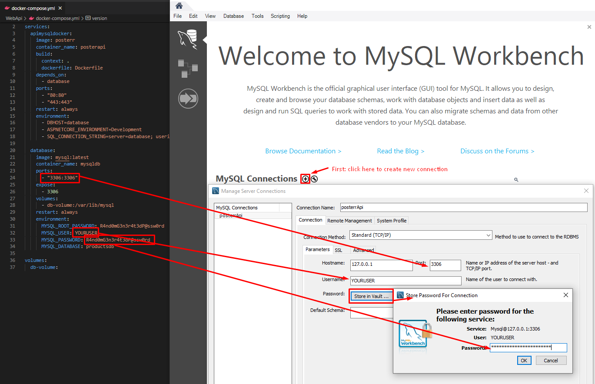
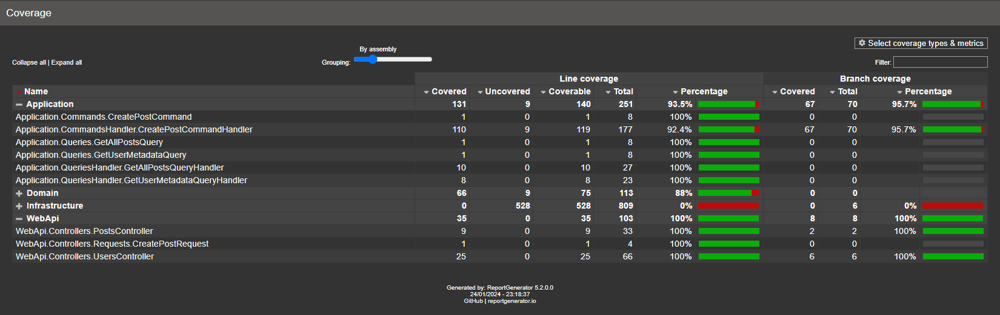

# About this project

This project is an WebApi for Posterr, a new social media.
In this API is possible to retrieve users metadatas, create a Post, Repost a Post and Quot, Quote a Post and Repost, Query Posts and filter them!


When analyzing the code, you will come across several concepts, such as database as code, unit tests, dependency injection, containerization, design patterns, RESTful API and much more!

# Prerequisites

Before you begin, make sure you have the following tools installed on your machine:
- [Docker](https://www.docker.com/)

# Execute project

Open the terminal in the project root folder and run the following commands:

```cd WebApi```

and then

```docker-compose up```

Done! Now you're able to interact with the API in the URL http://localhost:80/swagger/index.html

# What happens when you execute docker-compose up

When running ```docker-compose up```, Docker Compose will create and start the containers specified in the docker-compose.yml file. It will also configure networking between the containers, ensuring that the .NET Core application is able to communicate with the MySQL database. 
As it runs, you will see logs indicating the initialization progress of each container.


The project follows the "Database as Code" approach, it means when the .NET container is up, migrations and seeds are automatically applied at application startup.
These configurations are available in WebApi/Extensions/MySqlExtensions.cs.

## How to access data in database

You can use any IDE you prefer, but I recommend MySql Workbanch.

Prerequisite: [MySql Workbanch](https://www.mysql.com/products/workbench/)

You can access the database using MySql Workbanch using the same credentials entered in the docker-compose.yml file.



# Patterns Used

## CQRS (Command Query Responsibility Segregation)
The project adopts the CQRS standard to separate commands from queries, promoting better scalability and maintainability.

## MediatR
MediatR is used to implement the Mediator pattern, facilitating CQRS implementation and separation of responsibilities.

## Repository Pattern
The Repository pattern is used to abstract data access, providing a consistent interface for interactions with the database.

## Dependency Injection
The application uses .NET Core's native dependency injection to facilitate code maintenance, testability and modularity.

# Tests

This project has unit tests whose objective is to validate the business rules (implemented in the query handlers and command handlers - Application layer) and validations carried out in the controller (WebApi layer), so it does not make sense to implement tests for some layers, such as the infrastructure layer where the best option is an integration test.



## How to generate Test Report

Open the terminal in the project root folder and run the following commands:

```cd .\WebApi\Tests\```

and then

```dotnet test --collect "Xplat Code Coverage"```

when the test execution ends, run:

```reportgenerator "-reports:TestResults\*\coverage.cobertura.xml" "-targetdir:coveragereport" -reporttypes:Html```

Now you're able to see the test report by opening WebApi/Tests/coveragereport/index.html

You can also generate the Test Report using Visual Studio:

Prerequisite: [Visual Studio](https://visualstudio.microsoft.com/)

In Visual Studio: Tools > Nuget Package Manager > Package Manager Console, select "Tests" project and execute ```dotnet test --collect "Xplat Code Coverage"```, after that go to the directory where the report was saved (normally WebApi/Tests/TestResults/{GUID}/coverage.cobertura.xml) and run ```reportgenerator "-reports:.\coverage.cobertura.xml" "-targetdir:coveragereport" -reporttypes:Html```, it will create a new folder named "coveragereport" containing the report in html format (file: index.html).

# Critique

- The application accesses the database using the root user, the ideal would be to create a user with fewer permissions for the application;
- The id of entities could be changed from int to guid for security reasons;
- In a scenario where many users start to access the application, it would be necessary to implement a caching layer, such as Redis;
- The application is decoupled from the database, which allows each of the technologies to scale on demand. Furthermore, the CQRS standard allows you to easily integrate with an external cache (e.g. Redis) to alleviate the demand on the database;
- In the current configuration, in a scenario where many users access the application, the first point to fail would be the database due to concurrency problems and lack of cache.